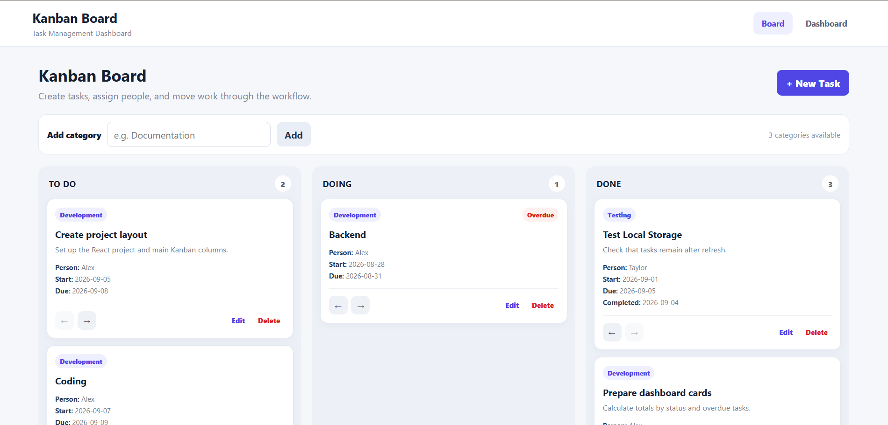
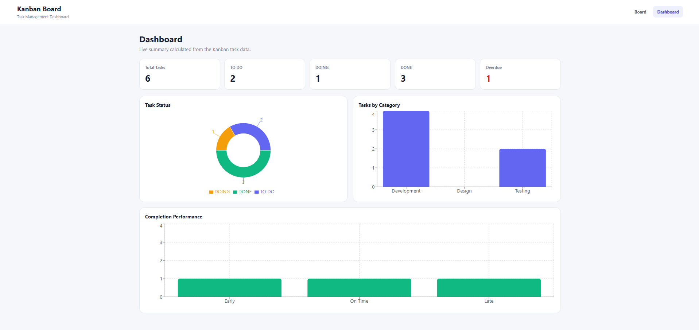

Kanban Board with Dashboard
React JS task-management application with a three-column Kanban board and dashboard. The application stores all tasks and categories in browser Local Storage, so no backend is required.

 Features

- Three Kanban columns: TO DO, DOING, DONE
- Create, edit, and delete tasks
- Move tasks between statuses
- Automatic completion date when moved to DONE
- Assign a responsible person
- Select existing categories and add new categories
- Local Storage persistence for tasks and categories
- Dashboard summary cards
- Task status doughnut chart
- Task category bar chart
- Completion performance chart (Early / On Time / Late)

Kanban Board

Dashboard

Group Member
Zwe Htet Nyein 6611923

Basic Usage

1. Open the Kanban Board page.
2. Click **New Task** to create a task.
3. Use the arrow buttons on a task card to move it between TO DO, DOING, and DONE.
4. Click **Edit** to update task information or **Delete** to remove the task.
5. Use the **Add category** field to create a new category.
6. Open the **Dashboard** page to view task summaries and charts.

 Technologies

- React JS
- Vite
- Recharts
- CSS
- Browser Local Storage
